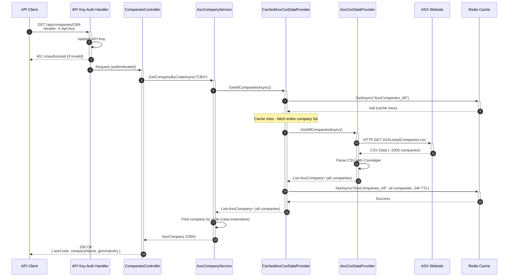
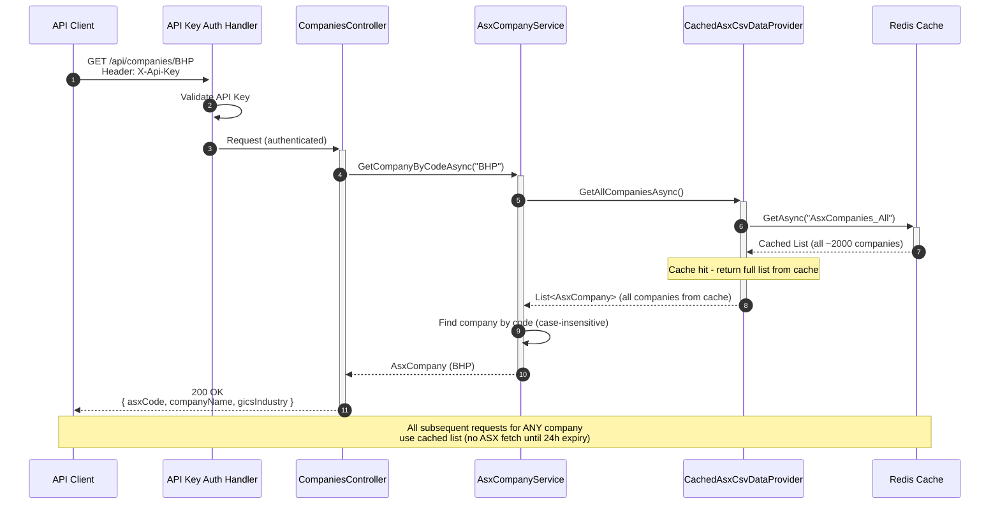
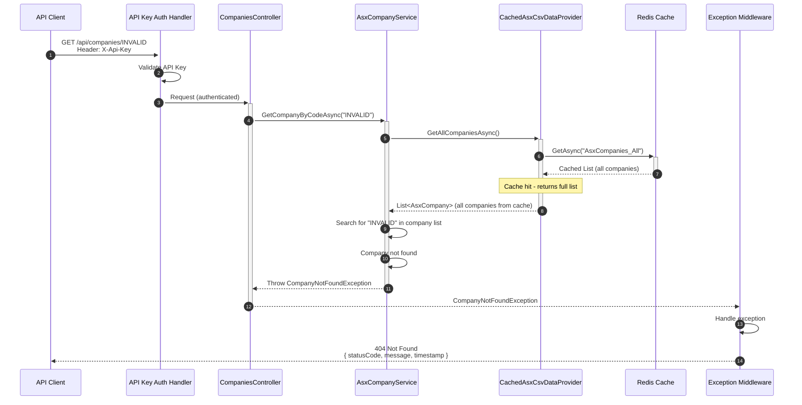

# ASX Company Lookup - Sequence Diagram

## Company Lookup Flow (Cache Miss - First Request)

```mermaid
sequenceDiagram
    autonumber
    participant Client as API Client
    participant Auth as API Key Auth Handler
    participant Controller as CompaniesController
    participant Service as AsxCompanyService
    participant CachedProvider as CachedAsxCsvDataProvider
    participant Provider as AsxCsvDataProvider
    participant ASX as ASX Website
    participant Cache as Redis Cache

    Client->>+Auth: GET /api/companies/CBA<br/>Header: X-Api-Key
    Auth->>Auth: Validate API Key
    Auth-->>-Client: 401 Unauthorized (if invalid)

    Auth->>+Controller: Request (authenticated)
    Controller->>+Service: GetCompanyByCodeAsync("CBA")

    Service->>+CachedProvider: GetAllCompaniesAsync()

    CachedProvider->>+Cache: GetAsync("AsxCompanies_All")
    Cache-->>-CachedProvider: null (cache miss)

    Note over CachedProvider: Cache miss - fetch entire company list

    CachedProvider->>+Provider: GetAllCompaniesAsync()

    Provider->>+ASX: HTTP GET ASXListedCompanies.csv
    ASX-->>-Provider: CSV Data (~2000 companies)

    Provider->>Provider: Parse CSV with CsvHelper
    Provider-->>-CachedProvider: List<AsxCompany> (all companies)

    CachedProvider->>+Cache: SetAsync("AsxCompanies_All", all companies, 24h TTL)
    Cache-->>-CachedProvider: Success

    CachedProvider-->>-Service: List<AsxCompany> (all companies)

    Service->>Service: Find company by code (case-insensitive)
    Service-->>-Controller: AsxCompany (CBA)
    Controller-->>-Client: 200 OK<br/>{ asxCode, companyName, gicsIndustry }
```

## Company Lookup Flow (Cache Hit - Subsequent Requests)

```mermaid
sequenceDiagram
    autonumber
    participant Client as API Client
    participant Auth as API Key Auth Handler
    participant Controller as CompaniesController
    participant Service as AsxCompanyService
    participant CachedProvider as CachedAsxCsvDataProvider
    participant Cache as Redis Cache

    Client->>+Auth: GET /api/companies/BHP<br/>Header: X-Api-Key
    Auth->>Auth: Validate API Key

    Auth->>+Controller: Request (authenticated)
    Controller->>+Service: GetCompanyByCodeAsync("BHP")

    Service->>+CachedProvider: GetAllCompaniesAsync()

    CachedProvider->>+Cache: GetAsync("AsxCompanies_All")
    Cache-->>-CachedProvider: Cached List (all ~2000 companies)

    Note over CachedProvider: Cache hit - return full list from cache

    CachedProvider-->>-Service: List<AsxCompany> (all companies from cache)

    Service->>Service: Find company by code (case-insensitive)
    Service-->>-Controller: AsxCompany (BHP)
    Controller-->>-Client: 200 OK<br/>{ asxCode, companyName, gicsIndustry }

    Note over Client,Cache: All subsequent requests for ANY company<br/>use cached list (no ASX fetch until 24h expiry)
```

## Error Flow - Company Not Found

```mermaid
sequenceDiagram
    autonumber
    participant Client as API Client
    participant Auth as API Key Auth Handler
    participant Controller as CompaniesController
    participant Service as AsxCompanyService
    participant CachedProvider as CachedAsxCsvDataProvider
    participant Cache as Redis Cache
    participant Middleware as Exception Middleware

    Client->>+Auth: GET /api/companies/INVALID<br/>Header: X-Api-Key
    Auth->>Auth: Validate API Key

    Auth->>+Controller: Request (authenticated)
    Controller->>+Service: GetCompanyByCodeAsync("INVALID")

    Service->>+CachedProvider: GetAllCompaniesAsync()

    CachedProvider->>+Cache: GetAsync("AsxCompanies_All")
    Cache-->>-CachedProvider: Cached List (all companies)

    Note over CachedProvider: Cache hit - returns full list

    CachedProvider-->>-Service: List<AsxCompany> (all companies from cache)

    Service->>Service: Search for "INVALID" in company list
    Service->>Service: Company not found
    Service-->>-Controller: Throw CompanyNotFoundException

    Controller-->>-Middleware: CompanyNotFoundException

    Middleware->>Middleware: Handle exception
    Middleware-->>Client: 404 Not Found<br/>{ statusCode, message, timestamp }
```
